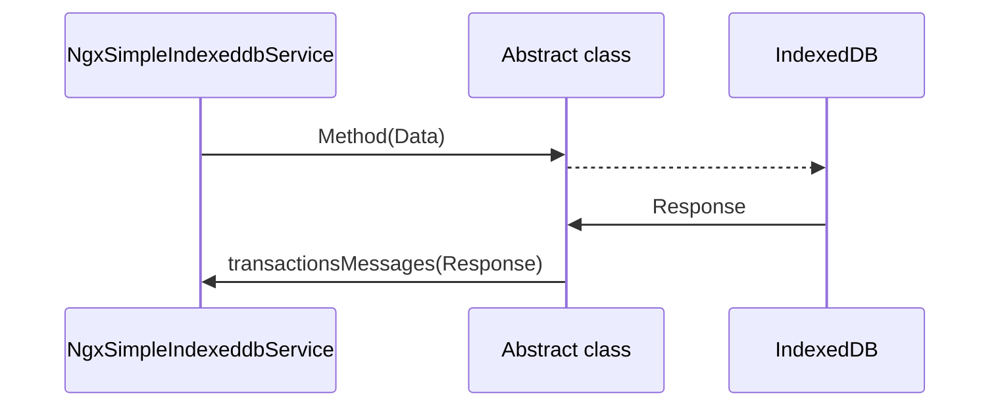

# NGX-SIMPLE-INDEXEDDB

This library aims to give you one better way to implement IndexedDB in ***Angular*** and more easy

## Install
```
npm install ngx-simple-indexeddb
```

## Setup
**Step 1**
Add the module in your application inside on imports

```
....
import { NgxSimpleIndexeddbModule } from  'ngx-simple-indexeddb';
....

@NgModule({
	declarations: [
	...
	],
	imports: [
		...,
		NgxSimpleIndexeddbModule.forRoot({
			dbName:  'NAME_DATABASE',
			dbVersion:  5
		}),
		...
	]
})
export  class  AppModule { }
```
  
**Step 2**
  - Call service when you need to use it
  - Inject in constructor
```
import { NgxSimpleIndexeddbService } from  'ngx-simple-indexeddb';

....

constructor(
	private _sIDB: NgxSimpleIndexeddbService
) { }

...

ngOnInit(): void {
	/*All results will be emitted at this observable, you can apply your logic inside the this block subscription*/
	this._sIDB.transactionsMessagesObs.subscribe(res => console.log(res));
}
```

**Step 3**
Execute operation needed

#### addItems

| Attribute |Type |Default | Description | Required |
|-----------|-----|--------|-------------|----------|
|storage|`string`||`Name of Object Storage`|true|
|data|`any`||`Data to save`| true
|indexes|`IndexObj`|Array<IndexObj>()|`List of indexes`| false
|autoIncrement |`boolean`|true|`Set to indexedDB how to manage key of records`| false|


- ***Create record(s) without index***
```
this._sIDB.addItems('NAME_OBJ_STORE', {name: 'Person 1', age: 25});
```

- ***Create record(s) with index***
```
//With indexes

const  indexes = [
	{id:  'by_name', name:  'name', unique:  true},
	{id:  'by_age', name:  'age', unique:  true}
];
const  data = [
	{name:  'Person 1', age:  25}, 
	{name:  'Person 2', age:  33}
];
this._sIDB.addItems('DB_EXAMPLE_INDEXED', data, indexes, true);
```

#### getItem

| Attribute |Type |Default | Description | Required |
|-----------|-----|--------|-------------|----------|
|storage|`string`||`Name of Object Storage`|true|
|key|`string|number`||`Key object to find`| true
|index|`string`||`Key Name index`| false|

- ***Get record without index***
```
this._sIDB.getItem('NAME_OBJ_STORE', 2);
```
- ***Get record with index***
```
this._sIDB.getItem('NAME_OBJ_STORE', 'Person 1', 'by_name');
```

#### getItems

| Attribute |Type |Default | Description | Required |
|-----------|-----|--------|-------------|----------|
|storage|`string`||`Name of Object Storage`|true|
|withKeys|`boolean`|false|`If you set this attribute in true, the response of query will return the primary key of each object  and value`| false|

- ***Get list records without primaryKey***
```
this._sIDB.getItems('NAME_OBJ_STORE');
```

- ***Get list records with primaryKey***
```
this._sIDB.getItems('NAME_OBJ_STORE', true);
```

#### updateItem

| Attribute |Type |Default | Description | Required |
|-----------|-----|--------|-------------|----------|
|storage|`string`||`Name of Object Storage`|true|
|key|`string|number`||`Key object to find`| true|
|newValue|`any`||`Object to save`| true|

- ***Update record***
```
const  data = [{name:  'Person 3', age:  26}];
this._sIDB.updateItem('NAME_OBJ_STORE', 'Person 1', data);
```

#### deleteItem

| Attribute |Type |Default | Description | Required |
|-----------|-----|--------|-------------|----------|
|storage|`string`||`Name of Object Storage`|true|
|key|`string|number`||`Key object to delete`| true|

- ***Delete record***
```
this._sIDB.deleteItem('NAME_OBJ_STORE', 2);
```

#### clearObjStorage

| Attribute |Type |Default | Description | Required |
|-----------|-----|--------|-------------|----------|
|storage|`string`||`Name of Object Storage`|true|

- ***Delete object storage***
```
this._sIDB.clearObjStorage('NAME_OBJ_STORE');
```

#### removeDB
```
this._sIDB.removeDB();
```

## Catalog Objects

This interface contain the data structure when observable emit data:
**ResponseStorageIndexedDB**  

| Attribute |Type |Description |
|-----------|-----|------------|
|func |`string`|`Name of function or operation that was called `|
|event |`string`|`Emitted result of execution, just there are two events: onSuccess, onError`|
|data |`any` |`Emitted data result of execution`|

This interface contain the structure when you needed add to store indexes
**IndexObj**

| Attribute |Type |Description |
|-----------|-----|------------|
|id|`string`|`Id index`|
|name |`string`|`Name of key path`|
|unique |`boolean` |`Set to IndexedDB that the value is unique`|


## UML diagram

This sequence diagram try to show data flow of library:

